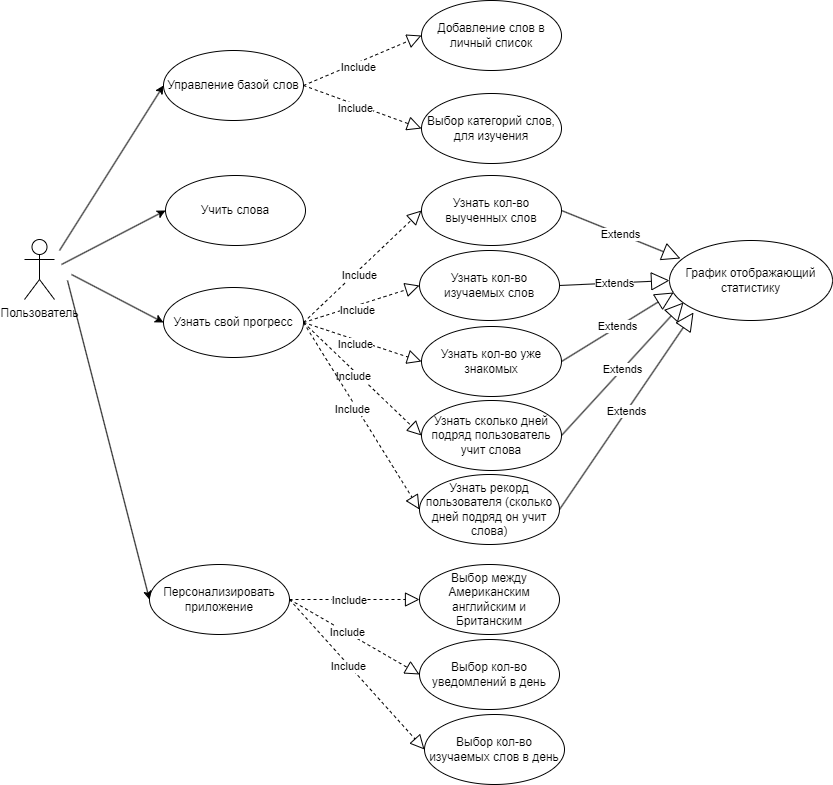

Перечень заинтересованных лиц:
1. Заказчик проекта: Суворов Александр Олегович - Доцент НИУ ВШЭ в Перми. Факультет социально-экономических и компьютерных наук.  Кафедра информационных технологий в бизнесе.
Заказчик определяет цели и требования проекта, утверждает его результаты, обеспечивает общий контроль.
2. Руководитель проекта: Суворов Александр Олегович - Доцент НИУ ВШЭ в Перми. Факультет социально-экономических и компьютерных наук.  Кафедра информационных технологий в бизнесе.
Руководитель проекта координирует выполнение задач, обеспечивает соответствие проекта требованиям заказчика, следит за сроками и качеством реализации.
3.	Главный разработчик: Деменев Юрий Михайлович студент 4 курса НИУ ВШЭ г. Пермь.
Отвечает за реализацию программного продукта, включая проектирование архитектуры приложения, написание кода, интеграцию алгоритмов и функционала.
4.	Главный дизайнер: Деменев Юрий Михайлович студент 4 курса НИУ ВШЭ г. Пермь.
Разрабатывает пользовательский интерфейс.
5. Пользователи Android устройств желающие выучить английские слова

Функциональные требования:
1. Управление базой слов
    1. 1. Приложение должно включать в себя слова необходимые для сдачи экзамена Cambridge на уровни знания английского A1,A2,B1,B2,C1 и слова из списка Oxford 5000.
    1. 2. Пользователь должен иметь возможность добавлять слова в личный список слов.
    1. 3. Приложения должно включать в себя деление слов по темам (Животные, погода и т.д).
2. Метод интервальных повторений
    2.1. Приложение должно реализовывать алгоритм интервального повторения для эффективного запоминания слов.
3. Статистика и прогресс
    3.1. Приложение должно сохранять и отображать пользователю его прогресс. Количество запомненных слов, количество слов, которые пользователь запоминает, количество слов, которые пользователь уже знает.
    3.2. Приложение должно отображать в виде графиков прогресс пользователя
    3.3. Приложение должно отображать пользователю процент выученных слов в каждой категории.
4. Синхронизация
    4.1 Приложения должно синхронизировать прогресс пользователя с облаком.
5. Персонализация
    5.1. Пользователь должен иметь возможность настроить количество изучаемых слов в день.
    5.2 Пользователь должен иметь возможность настроить количество получаемых уведомлений в день.
    5.3 Пользователь должен иметь возможность выбрать между Американским английским и Британским английским.
6. Оптимизация
    6.1 Приложение должно кэшировать слова в оперативной памяти для оптимизации процессов и улучшения пользовательского опыта
Диаграмма вариантов использования для функциональных требований: 

Перечень сделанных предположений:
1.	Приложение через 7 месяцев после начала разработки будет размещено в Google Play.
2.	Приложение через 2 месяца после запуска получит поддержку дополнительных языков.
3.	Приложение через 2 месяца после запуска получит виджеты, чтобы напоминать пользователю об изучении новых слов, если он еще сегодня не учил слова.
4.	Приложении через 2 месяца после запуска получит расширение базы слов. Приложение получит дополнительные слова, разбитые по темам.
