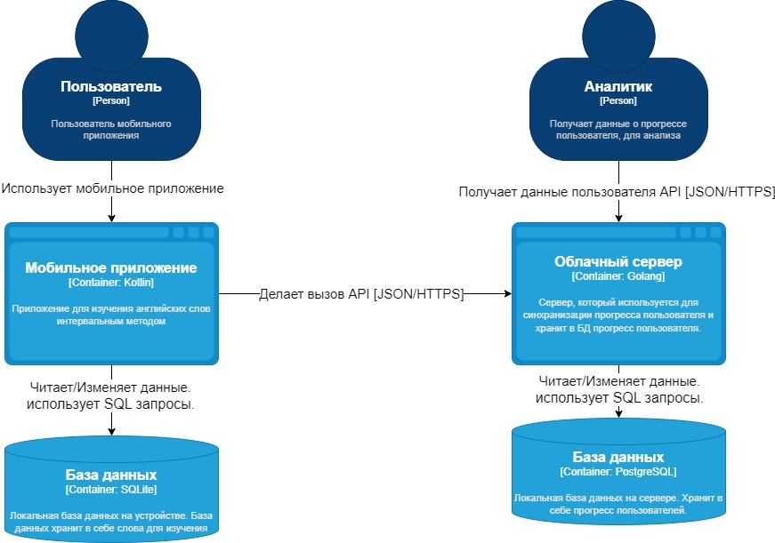
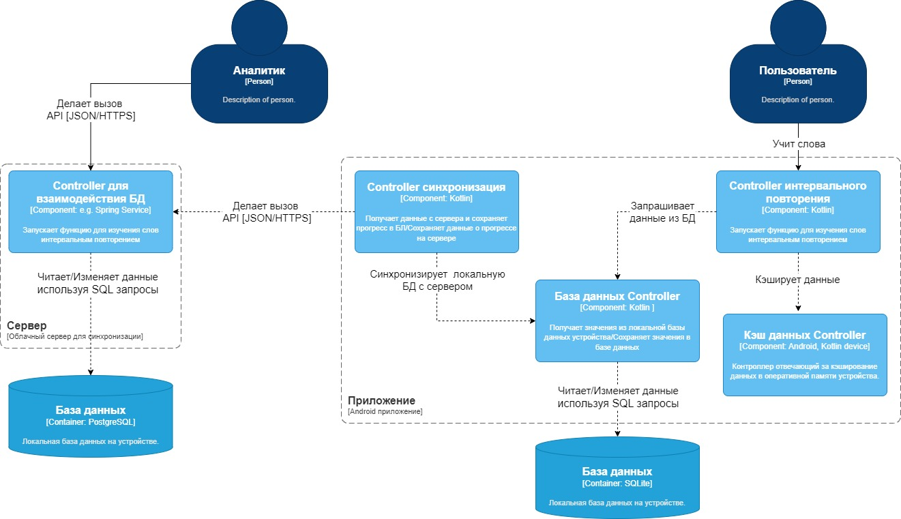

Диаграмма системного контекста

Диаграмма контейнеров 
Программный продукт представляет из себя мобильное приложение на телефоны с операционной системой Android. Помимо приложения на телефон, будет разработан микросервис, отвечающий за синхронизацию прогресса пользователя. Он будет сохранять прогресс пользователя, также, аналитик сможет получить от этого микросервиса данные для анализа. 

 
Диаграмма компонентов 

 