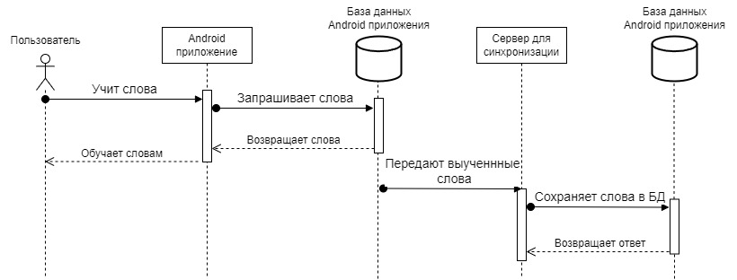
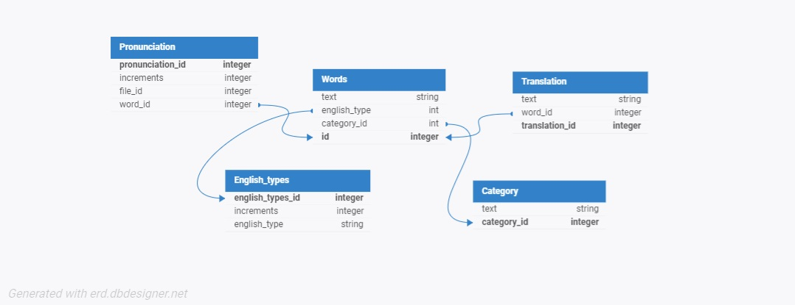

Диаграмма контейнеров 
Программный продукт представляет из себя мобильное приложение на телефоны с операционной системой Android. Помимо приложения на телефон, будет разработан микросервис, отвечающий за синхронизацию прогресса пользователя. Он будет сохранять прогресс пользователя, также, аналитик сможет получить от этого микросервиса данные для анализа. 

 
Диаграмма компонентов 

 
Диаграмма последовательностей

База данных UML

// ViewModel для управления данными слов
class WordViewModel(private val repository: WordRepository) : ViewModel() {

    // Список слов в формате LiveData
    val words: MutableLiveData<List<Word>> = MutableLiveData()

    // Загрузить все слова из базы
    fun loadWords() {
        words.value = repository.getAllWords()
    }

    // Добавить новое слово
    fun addWord(text: String, translation: String, level: String, variant: String) {
        val word = Word(text = text, translation = translation, level = level, variant = variant)
        repository.addWord(word)
        loadWords() // Обновить данные
    }
}
//KISS: Только нужные функции.
//YAGNI: Нет лишней логики, только базовые операции.

// Модель данных для слов
@Entity(tableName = "words")
data class Word(
    @PrimaryKey(autoGenerate = true) val id: Int = 0,
    val text: String,         // Слово на английском
    val translation: String,  // Перевод
    val level: String,        // Уровень (A1, A2, B1, ...)
    val variant: String       // Американский, британский или универсальный
)

// Интерфейс для работы с базой данных (DAO)
@Dao
interface WordDao {
    // Вставить слово в базу
    @Insert(onConflict = OnConflictStrategy.REPLACE)
    fun insert(word: Word)

    // Получить все слова
    @Query("SELECT * FROM words")
    fun getAllWords(): List<Word>

    // Удалить все слова
    @Query("DELETE FROM words")
    fun deleteAll()
}
//KISS: Простая структура базы данных.
//DRY: Один интерфейс для базовых операций.
//SOLID: Принцип единственной ответственности (SRP) и инверсии зависимостей (DIP).

// Репозиторий для работы с базой данных
class WordRepository(private val wordDao: WordDao) {

    // Получить список всех слов
    fun getAllWords(): List<Word> = wordDao.getAllWords()

    // Добавить слово в базу
    fun addWord(word: Word) = wordDao.insert(word)

    // Очистить базу данных
    fun clearDatabase() = wordDao.deleteAll()
}
//DRY: Избегаем повторения кода, используя репозиторий.
//SOLID: Принцип инверсии зависимостей (DIP).